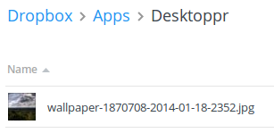

Basic Usage
***********
The four object types
=====================
Before we dive into using the API, you should understand that the wrapper returns four object types:

* :class:`~DesktopprApi.Page` -- Page of information, containing information about other pages and containing a list of either :class:`~DesktopprApi.Wallpaper` or :class:`~DesktopprApi.User` objects.
* :class:`~DesktopprApi.Wallpaper` -- Object defining a wallpaper on the site, containing information about the image, thumbnail and preview image, and metadata about the image.
* :class:`~DesktopprApi.User` -- Object defining a user on the site, containing metadata about them, including things like sign up date and likes count.
* :class:`~DesktopprApi.Image` -- Object defining an image on the site. It is contained in a :class:`~DesktopprApi.Wallpaper` object. It contains the direct URLs to images (full, preview, and thumbnails)
  

Examples
========
A simple test
-------------

Let's start with a very simple test. You want to get the number of wallpapers the user *keithpitt* has in their collection. It's as simple as follows:

.. code-block:: python

	>>> import DesktopprApi
	>>> api = DesktopprApi.DesktopprAPI()
	>>> user = api.get_user_info('keithpitt')
	>>> user.wallpapers_count
	93

Each of the four object types have all attributes that the server responds with available by *objectname.attribute*.

Another simple example
----------------------
We want to sync a wallpaper to our DropBox progmatically. In this instance, we want it to be random wallpaper that's safe for work.
Assuming we already have linked a DropBox account and have our API key, we can do it as follows:

.. code-block:: python

	>>> import DesktopprApi
	>>> api = DesktopprApi.DesktopprAPI()
	>>> wallpaper = api.get_random_wallpaper()
	>>> api.authorize_API('YOUR_API_KEY_HERE')
	>>> api.sync_wallpaper(wallpaper.id)

And voilà, it works!

Getting straight URLs
=====================

The method :meth:`~DesktopprApi.DesktopprAPI.get_wallpaper_urls` is a convenience method built into the wrapper that allows you to get direct URLs to full resolution images. 

